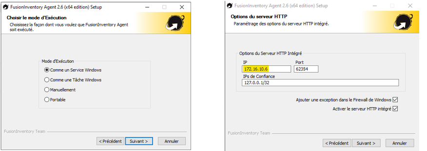

# GLPI, Fusion Inventory, Nagios - Cas pratique

## Informations

| Champ           | Détails                                            |
|-----------------|----------------------------------------------------|
| **Auteur**      | William Mbakop                                     |
| **Profession**  | étudiant en alternance - BTS SIO SISR              |
| **Version**     | 1.0.0                                              |
| **Date**        | 9 janvier 2025                                     |
| **Description** | GLPI, Fusion Inventory, Nagios - Cas pratique      |

## Pré-requis

### Les machines virtuelles :
- VM serveur Linux : 
    - VM serveur Linux 
    - VM cliente Linux et/ou Windows

### Configuration des VM linux sur VMWare WorkStation Pro 17 :

- [Ubuntu 22.04.05](https://releases.ubuntu.com/jammy/ubuntu-22.04.5-desktop-amd64.iso)
- Ram 4 Go
- Décocher Accélération 3D graphics


### Configuration de la VM Windows sur VMWare WorkStation Pro 17 :

- Windows 10
- Ram 4 Go
- Décocher Accélération 3D graphics


## Installation de GLPI sur la <ins>VM serveur<ins>

### Installation de apache2, php, mysql-server phpmyadmin et des dépendances nécessaires

``` bash

touch script.sh
chmod 777 script.sh
nano script.sh

    # Ajouter les lignes ci-dessous :

    # Mise à jour et mise à niveau du système
    apt update -y
    apt dist-upgrade -y

    # Installation du serveur web et des composants de base
    apt install apache2 -y
    apt install php -y
    apt install mysql-server -y
    apt install phpmyadmin -y

    # Installation des dépendances PHP nécessaires
    apt install libapache2-mod-php -y
    apt install php-mysql -y
    apt install php-curl -y
    apt install php-gd -y
    apt install php-intl -y
    apt install php-json -y
    apt install php-mbstring -y
    apt install php-xml -y
    apt install php-zip -y
    apt install php-cas -y
    apt install php-imap -y
    apt install php-ldap -y
    apt install php-xmlrpc -y
    apt install apcupsd -y
    apt install php-apcu -y
    apt install php-bz2 -y

    # Redémarrage du système
    init 6
```

# Démarrage de Apache 2

``` bash
# Ouverture du fichier apache2.conf

nano /etc/apache2/apache2.conf

	# Ajouter les lignes ci-dessous :
	
    ServerRoot "/etc/apache2"
    ServerName srvub22

# Redemarrage du service Apache2 et Affichage du status

systemctl restart apache2 && systemctl status apache2

# Affichage de l'adresse ip

hostname -I

```

Ouvrir le navigateur et et renseigner http://adresseIP


# Configuration de Mysql

```bash
# Se connecter à MySQL en tant qu'utilisateur root
mysql -u root -p

# Créer une nouvelle base de données GLPIA
CREATE DATABASE GLPIA ;

# Créer un utilisateur 'UGLPI' avec un mot de passe 'toto'
CREATE USER "UGLPI"@"LOCALHOST" IDENTIFIED BY "toto" ;

# Sélectionner la base de données GLPIA pour y travailler
use GLPIA ;

# Accorder tous les privilèges à l'utilisateur 'UGLPI' sur la base de données GLPIA
GRANT ALL PRIVILEGES ON GLPIA.* TO "UGLPI"@"LOCALHOST";

# Quitter la session MySQL une fois les modifications effectuées
exit

# Créer un répertoire pour stocker les fichiers source de GLPI
mkdir -p /usr/src/glpi

# Se déplacer dans le répertoire où GLPI sera téléchargé
cd /usr/src/glpi

# Télécharger la dernière version stable de GLPI depuis GitHub
wget https://github.com/glpi-project/glpi/releases/download/10.0.6/glpi-10.0.6.tgz

# Extraire l'archive téléchargée dans le répertoire web /var/www/html/
tar -xvzf glpi-10.0.6.tgz -C /var/www/html/

# Se déplacer dans le répertoire où GLPI a été extrait pour appliquer les permissions
cd /var/www/html/glpi

# Appliquer des permissions d'écriture et d'exécution à tous les utilisateurs sur les fichiers GLPI
chmod 777 -R /var/www/html/glpi

# Changer le propriétaire des fichiers pour l'utilisateur 'www-data' (utilisé par Apache)
chown www-data -R /var/www/html/glpi

# Redémarrer Apache pour appliquer les modifications et vérifier son statut
systemctl restart apache2 && systemctl status apache2
```

Dans le navigateur : http://adresseIP/glpi/

Cliquer sur :
- Ok pour sélectionner la langue
- Continuer
- Installer
- Continuer

Renseigner :
- Serveur SQL : localhost
- Utilisateur SQL : UGLPI
- Mot de passe : toto

Sélectionner GLPIA puis cliquer sur Continuer
Quand la base de donnée a été initialisée, cliquer sur Continuer
Cliquer sur Continuer x 2
Cliquer sur Utiliser GLPI

identifiant : glpi
Mot de passe : glpi
Cliquer sur Se connecter


## Installation de Fusion Inventory 

### Configuration de la <ins>VM serveur<ins>

```bash
# Se déplacer dans le répertoire des plugins de GLPI pour installer un plugin

cd /var/www/html/glpi/plugins/

# Télécharger le plugin FusionInventory pour GLPI depuis GitHub

wget https://github.com/fusioninventory/fusioninventory-for-glpi/releases/download/glpi10.0.6%2B1.1/fusioninventory-10.0.6+1.1.tar.bz2

# Extraire l'archive du plugin FusionInventory dans le répertoire actuel

tar -xf fusioninventory-10.0.6+1.1.tar.bz2 

# Installer le paquet 'fusioninventory-agent' sur le système (pour la gestion des équipements)

apt install fusioninventory-agent -y

# Se déplacer dans le répertoire de configuration de l'agent FusionInventory

cd /etc/fusioninventory

# Modifier le fichier de configuration de l'agent FusionInventory avec nano

nano agent.cfg

    # Décommenter server
    # Mettre server = http://localhost/glpi/plugins/fusioninventory/
    # Mettre 2 à debug

# Lancer l'agent FusionInventory avec le fichier de configuration spécifié
fusioninventory-agent --conf-file=/etc/fusioninventory/agent.cfg

```

Actualiser le navigateur et aller dans Parc > Tableau de Bord 


### Installation de l'agent Fusion Inventory sur <ins> les VM clientes Linux <ins>

```bash
# Se déplacer dans le répertoire fusioninventory (assurez-vous que ce répertoire existe déjà)
cd fusioninventory

# Télécharger le plugin FusionInventory pour GLPI depuis GitHub
wget https://github.com/fusioninventory/fusioninventory-for-glpi/releases/download/glpi10.0.6%2B1.1/fusioninventory-10.0.6+1.1.tar.bz2

# Extraire l'archive du plugin FusionInventory dans le répertoire actuel
tar -xf fusioninventory-10.0.6+1.1.tar.bz2 

# Installer le paquet 'fusioninventory-agent' sur le système pour permettre la gestion des équipements
apt install fusioninventory-agent -y

# Se déplacer dans le répertoire de configuration de l'agent FusionInventory
cd /etc/fusioninventory

# Modifier le fichier de configuration de l'agent FusionInventory avec l'éditeur nano
nano agent.cfg

    # Décommenter server
    # Mettre server = http://172.16.10.254/glpi/plugins/fusioninventory/
	# Mettre 2 à debug

# Lancer l'agent FusionInventory en utilisant le fichier de configuration spécifié
fusioninventory-agent --conf-file=/etc/fusioninventory/agent.cfg
```

### Installation de l'agent Fusion Inventory sur <ins> la VM cliente Windows <ins>

Aller sur https://github.com/fusioninventory/fusioninventory-agent/releases/tag/2.6

Cliquer sur fusioninventory-agent_windows-x64_2.6.exe et procéder à l'installation





Actualiser le navigateur de la VM serveur


## Installation de Nagios

### Sur la machine serveur

```bash
# Installer les dépendances nécessaires à la compilation et à l'installation de Nagios et de ses plugins
apt install -y autoconf bc gawk dc build-essential gcc libc6 make wget unzip apache2 php libapache2-mod-php libgd-dev libmcrypt-dev make libssl-dev snmp libnet-snmp-perl gettext

# Installer des outils supplémentaires nécessaires à la gestion du serveur et des compilations
apt install wget unzip zip autoconf gcc libc6 make apache2-utils libgd-dev -y

# Installer des paquets supplémentaires pour la compilation et la gestion de Nagios
apt-get install build-essential openssl

# Créer un nouvel utilisateur 'nagios' et l'ajouter au groupe www-data
useradd -m nagios -G www-data

# Créer un répertoire 'nagios' pour y télécharger les sources de Nagios
mkdir nagios 

# Se déplacer dans le répertoire 'nagios'
cd nagios

# Télécharger l'archive contenant Nagios version 4.4.6 depuis le site officiel
wget https://assets.nagios.com/downloads/nagioscore/releases/nagios-4.4.6.tar.gz

# Extraire l'archive téléchargée contenant Nagios
tar -xvzf nagios-4.4.6.tar.gz

# Se déplacer dans le répertoire de Nagios extrait
cd nagios-4.4.6

# Configurer Nagios en spécifiant le répertoire de configuration d'Apache
./configure --with-httpd-conf=/etc/apache2/sites-enabled

# Compiler les fichiers source de Nagios
make all 

# Installer les groupes et utilisateurs nécessaires à Nagios
make install-groups-users && make install

# Installer le démon Nagios et le lancer
make install-daemoninit

# Installer les fichiers de configuration de Nagios
make install-config

# Redémarrer Apache pour appliquer les configurations
systemctl restart apache2

# Installer l'interface graphique "Exfoliation" de Nagios
make install-exfoliation

# Installer l'interface classique de Nagios
make install-classicui

# Compiler tous les fichiers nécessaires
make all

# Réinstaller les groupes et utilisateurs de Nagios
make install-groups-users

# Ajouter l'utilisateur 'www-data' au groupe 'nagios' pour lui donner accès à Nagios
usermod -a -G nagios www-data

# Installer les fichiers nécessaires pour le fonctionnement de Nagios
make install 

# Initialiser les fichiers de configuration de Nagios
make install -init

# Installer le mode de commande de Nagios
make install-commandmode

# Installer les fichiers de configuration de Nagios
make install-config

# Installer la configuration web de Nagios
make install-webconf

# Activer les modules Apache 'rewrite' et 'cgi' nécessaires au fonctionnement de l'interface web de Nagios
a2enmod rewrite cgi

# Créer un utilisateur 'nagiosadmin' et lui attribuer un mot de passe pour accéder à l'interface web de Nagios
htpasswd -c /usr/local/nagios/etc/htpasswd.users nagiosadmin

# Installer les plugins de surveillance Nagios et le plugin NRPE pour l'exécution des commandes à distance
apt install monitoring-plugins nagios-nrpe-plugin -y

# Se déplacer dans le répertoire de configuration de Nagios
cd /usr/local/nagios/etc

# Modifier le fichier de configuration principal de Nagios (nagios.cfg) avec un éditeur de texte
nano nagios.cfg

    # Décommenter ces quatre lignes :

    # cfg_dir=/usr/local/nagios/etc/servers
    # cfg_dir=/usr/local/nagios/etc/printers
    # cfg_dir=/usr/local/nagios/etc/switches
    # cfg_dir=/usr/local/nagios/etc/routers

# Créer un répertoire pour les serveurs, imprimantes, commutateurs (switches), et routeurs
mkdir servers printers switches routers

# Ouvrir le fichier de configuration 'resource.cfg' avec l'éditeur de texte nano
nano resource.cfg

    # commenter $USER1$=/usr/local/nagios/libexec
    # ajouter $USER1$=/usr/lib/nagios/plugins
```


```bash
# Se déplacer dans le répertoire 'objects' où les objets de configuration sont stockés
cd objects

# Ouvrir le fichier de configuration 'contacts.cfg' 
nano contacts.cfg
```
Ajouter son adresse mail


```bash
# Ouvrir le fichier de configuration 'commands.cfg' 
nano commands.cfg

    # Tout en bas du fichier rajouter ces lignes :

    define command {
        command_name check_nrpe
        command_line $USER1$/check_nrpe -H $HOSTADDRESS$ -c $ARG1$
    }
```


```bash
# Redémarrer le service Apache2 et afficher son statut pour vérifier qu'il fonctionne correctement
systemctl restart apache2 && systemctl status apache2

# Redémarrer le service Nagios et afficher son statut pour vérifier qu'il fonctionne correctement
systemctl restart nagios && systemctl status nagios
```
Aller dans le navigateur et taper http://adresseIP/nagios

Saisir le nom d'utilisateur "nagiosadmin" et le mot de passe "nagiosadmin"

Pour rappel, on a défini le nom d'utilisateur plus haut (cf. htpasswd -c /usr/local/nagios/etc/htpasswd.users nagiosadmin).

Par défaut le mot de passe est identique au nom d'utilisateur


Dans la rubrique host, on peut voir que la VM serveur s'affiche


Afin que le nom de la VM s'affiche  au lieu de localhost

```bash
# Ouvrir le fichier /usr/local/nagios/etc/objects/localhost.cfg
nano /usr/local/nagios/etc/objects/localhost.cfg
```
Remplacer tous les localhost par le nomDeLaMachineServeur : srvub22


### Sur les machines clientes Linux

```bash
# Installer le serveur NRPE (Nagios Remote Plugin Executor) qui permet à Nagios de surveiller des hôtes distants
sudo apt-get install nagios-nrpe-server -y

# Installer les plugins Nagios nécessaires pour effectuer des vérifications sur les hôtes et services
sudo apt-get install nagios-plugins -y

# Ouvrir le fichier de configuration du serveur NRPE (/etc/nagios/nrpe.cfg) avec l'éditeur de texte nano
sudo nano /etc/nagios/nrpe.cfg

    # chercher la ligne allowed_hosts et ajouter l'IP de la VM serveur
```


Sur la machine serveur :  

```bash
# Ouvrir le fichier /usr/local/nagios/etc/objects/localhost.cfg
nano /usr/local/nagios/etc/objects/localhost.cfg
```

Rajouter ces lignes :


```bash
# Vérifier la configuration de Nagios pour détecter d'éventuelles erreurs avant de démarrer le service
sudo /usr/local/nagios/bin/nagios -v /usr/local/nagios/etc/nagios.cfg

# Redémarrer le service Nagios pour appliquer les modifications après une vérification de configuration
sudo systemctl restart nagios
```

Actualiser la page web 


On constate que la VM cliente est bien remontée.

Faire cela pour toutes les VM clientes linux


### Sur les machines clientes Windows

Télécharger le fichier https://sourceforge.net/projects/nscplus/files/latest/download


Sur la machine serveur :  

```bash
# Ouvrir le fichier /usr/local/nagios/etc/objects/localhost.cfg
nano /usr/local/nagios/etc/objects/localhost.cfg
```


Actualiser le navigateur

Toutes les VMs devraient s'afficher.


Dans la capture d'écran ci-dessous, les VMs qui sont eteintes sont en status Down